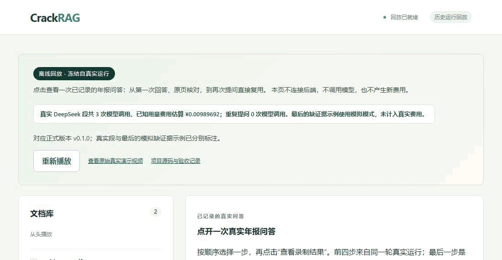

# CrackRAG

**读年报的人常遇到两件事：模型给了一个数字，却难以核对它来自哪一页、哪一年、什么口径；换个问法，又要从头调用模型。**

CrackRAG 针对明确的财务数字提问：把答案连到原 PDF 的引用区域，证据不够就说明缺口；
数字经验证并保存后，相同需求可以直接复用。在一轮已记录的真实演示中，
“松霖科技 2024 年合并营业收入”首次回答用了 1 次模型调用，保存后重复和改写提问均为 **0 次模型调用**。

[](https://xjfyrh.github.io/CrackRAG/demo/)

**[点开静态回放，亲自核对答案和原页](https://xjfyrh.github.io/CrackRAG/demo/)** ·
[观看 5:13 真实模型录像](https://github.com/XJfyrh/CrackRAG/releases/download/v0.1.0/demo-v0.1.0-live.webm) ·
[查看费用与原始记录](docs/live-demo.md)

动图与回放的前四步来自同一轮真实 DeepSeek 运行（共 3 次调用，已知用量费用估算 ¥0.00989692）；
最后的“证据不足”是**单独录制的模拟示例**，不计入真实费用。回放页无需安装，也不发起新模型请求。

### 实测数字（v0.1.0，可追溯）

| | 结果 | 出处 |
| --- | --- | --- |
| 独立质量小样 | 12 / 12 通过（6 正例、4 负例、2 复用），来源为两份未用于调试的年报 | [质量报告](docs/quality-results-v3.md) |
| 短序列模型费用 | 构建臂 0.02354064 元 vs 基线 0.02575216 元（−8.59%，两来源 16 条序列） | [费用报告](docs/cost-results-v3.md) |
| 事实复用 | 4 条重复/改写查询均直接使用有效事实、0 次模型调用 | [费用报告](docs/cost-results-v3.md) |
| 故障恢复 | 候选落库后杀主实例并重启 Redis，副实例接续同一任务，调用数 2→2 不变 | [验收记录](docs/release-validation.md) |
| 回归 | Go 579 个子测试、Python 241 项、全新空卷备份恢复通过 | [验收记录](docs/release-validation.md) |

### 三个关键设计

1. **发布权不在模型手里。** 模型只能提出候选；Go 在最终事务里重核身份、版本、权限与来源语义，
   通过才原子发布。未经验证的声明永远不会作为事实发给浏览器。
2. **首次构建与后续复用分开计费。** 复用省钱不代表整段序列省钱——我们保留了一轮**费用反而
   增加 16.65%** 的实验结果，没有删掉它（[原结果](docs/cost-results-v1.md)）。
3. **费用先按冷价预留。** 缓存经验窗口只用于调度判断，不代表供应商承诺命中；未知费用保留占用
   并停止后续真实派发，而不是自动重试把账算糊。

**不能声称什么**：不承诺通用财报准确率、任意问题降本、供应商缓存必然命中、OCR 或跨页表格理解。
样本量小且来源是目的性选取；上述数字只适用于对应场景与冻结输入。

## 支持范围

- Linux amd64、CPU、Docker Compose；Windows 使用 Docker Desktop 的 Linux 容器。
- 默认 mock，不需供应商密钥或 BGE 权重；真实模式显式准备 DeepSeek 与本地 BGE-M3。
- 明确实体、年度、合并口径的营业收入、营业成本、净利润，以及原文披露或已有有效派生事实的毛利率。
- 来源需要可核验的文本层、实体、年份列、单位和口径。缺证据返回 `INCONCLUSIVE`；不支持的问题返回 `UNSUPPORTED`。
- 首发不提供开放式问答、OCR、复杂跨页表格推理和任意计算。未识别实体需通过经审查的词表变更支持。

## 本机启动

最快体验：打开[静态回放](https://xjfyrh.github.io/CrackRAG/demo/)，无需安装；或看
[真实模型录像](https://github.com/XJfyrh/CrackRAG/releases/download/v0.1.0/demo-v0.1.0-live.webm)。要自己导入文档并提问，需要 Docker：

产品管理入口只需宿主安装 Docker 与 Docker Compose。源码可用 Git 获取，或解压发行包；开发及可选验收脚本另有测试依赖。首次构建会下载镜像和锁定的依赖；mock 不下载模型权重。

```sh
git clone https://github.com/XJfyrh/CrackRAG.git
cd CrackRAG
git checkout v0.1.0
./crackrag init
./crackrag up
```

使用发行源码 ZIP/tar.gz 时，解压并进入其中的目录，直接从 `./crackrag init` 开始，不需要 Git。

打开 <http://localhost:18086>，使用 `.release/secrets/access_token` 内本机随机令牌登录。初始化生成的 `.release/` 是私有目录，不提交、不复制到公开发行包。

Windows PowerShell 使用 `./crackrag.ps1` 执行相同子命令。需要已启动 Docker Desktop 并切换到 Linux 容器。

## 演示路线

1. 下载页面中的自制正例，上传 `financial.pdf`，解析第 1 页。
2. 选择该文档，查询“样例控股2024年营业收入是多少？”，先关闭事实构建。核对答案、原页和本次调用。
3. 再次查询并勾选“为以后提问保存数字”，选择“立即处理”。后台通过验证后，数字才可供下次复用；真实模式下会产生额外费用。
4. 等页面显示“已保存可复用的数字”后重复该问题，查看本次是否直接复用、模型调用数是否为零。
5. 上传并**只选择** `ambiguous.pdf`，询问净利润。该样例缺少要求的口径附注，应解释证据不足。
6. 从“最近查询”切换历史、刷新页面，确认沿用原查询，无新收费请求。
7. 如需观察谨慎的保存方式，单独询问营业成本并选择“谨慎执行”。条件不合适时会跳过，不保证本次一定保存。默认模拟模式的这一步仅展示流程。

推荐先看 [5 分 13 秒真实演示](https://github.com/XJfyrh/CrackRAG/releases/download/v0.1.0/demo-v0.1.0-live.webm)：官方年报 → DeepSeek 首问 → 显式构建 → 重复与改写查询均零模型调用 → 原 PDF 核对与刷新恢复。本次共 3 次真实模型调用，费用估算 0.00989692 元，详见 [演示说明与记录](docs/live-demo.md)。这是既有样本上的功能展示，独立的 [质量](docs/quality-results-v3.md) 与 [费用](docs/cost-results-v3.md) 评测另有报告。

原 [4 分 21 秒 mock 演示](https://github.com/XJfyrh/CrackRAG/releases/download/v0.1.0/demo-v0.1.0.webm) 保留，方便无密钥体验完整流程。受控恢复、备份和真实模式步骤见 [运行手册](docs/operations.md)。

## 实现

[架构与信任边界](docs/architecture.md) · [开发与分支约定](docs/development.md) · [发布验收记录](docs/release-validation.md)

Go 负责鉴权、数据库事务、最终语义验证和答案生成。Python 负责解析、检索编排和模型交互。PostgreSQL 保存来源、候选、验证报告、有效事实、任务和费用；Redis 用于恢复通知。刷新页面或重连不会重新提交问题。

费用准入使用冷价上界，结算记录供应商实际 usage 的估算金额；未知费用保留占用并停止后续真实派发。缓存经验窗口只用于调度判断，不代表供应商承诺命中或缓存生命周期。

## 许可

自有源码与自制样例采用 [MIT](LICENSE)。依赖各自适用原许可，特别是 PyMuPDF/MuPDF 的 AGPL 或商业许可；详见[第三方许可](THIRD_PARTY_NOTICES.md)。这里的 MIT 声明不覆盖完整依赖组合。

完整发行人 PDF 不随仓库分发，使用官方链接和摘要复现；唯一例外是**离线回放演示所需的单个被引用页**
（`web/public/samples/demo-annual-report.pdf`），来自公开披露的年度报告，仅用于展示证据区域高亮，
许可见第三方许可说明。
