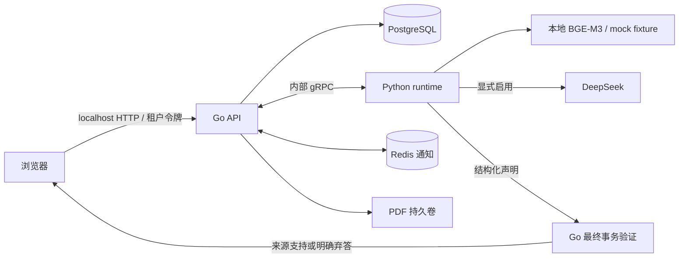

# 架构与信任边界

## 回答与事实分离

查询首先解析精确需求，并检查当前租户可访问、文档版本适用的有效事实。FULL 路径重读事实，不调用模型；PARTIAL 只补缺口。模型只能提出带需求标识、区域、逐字引文、原始值和规范化值的声明，或者弃答。自由正文不作为展示答案。

Go 在最终提交事务中核对保存的原问题、实体、期间、单位倍率、合并口径、来源观察、文档与配置版本、授权、取消和截止状态，然后生成 `answer.text` 与 `answer_validation`。未经权威检查的声明不会提前作为 SSE 事实事件发给浏览器。

原文回答验证没有发布事实的权限。显式后台构建经过候选持久化、确定性验证、受限只读 Probe（需要时）、不可变验证报告，最后由 Go 原子提交有效事实。REJECTED 和 INCONCLUSIVE 候选不进入普通读取。派生事实绑定有效输入和版本化公式。

## 恢复与费用

数据库是任务、幂等身份、来源、报告和账本的权威存储。Redis 通知丢失时可从数据库恢复。租约与 fencing 阻止旧实例提交；候选已保存后可继续验证，禁止因恢复重复抽取。不确定的物理调用保持 UNKNOWN，不自动重试。

真实请求同时受项目累计余额、当前 live session 金额/次数、Run 限制和并发槽控制。历史费用通过不可变、幂等的 opening balance 接续，不通过换数据库重置预算。只允许一个活跃的付费环境。

`release-manifest-v1` 绑定镜像内代码、构建、配置、提示和模型资产描述；`live-session-manifest-v1` 将该身份绑定到新鲜价格、历史占用、局部预算和启停控制。

## 明确限制

这是受控财务标量系统。模型自信、数字出现在页面上、相似概念名和过期缓存观察都不能替代语义证据。当前解析器不承担跨页表格关联、OCR 或任意口径推断。经验缓存信号可能判断错误，因此始终按冷价预留，并报告整个查询与构建序列费用。
